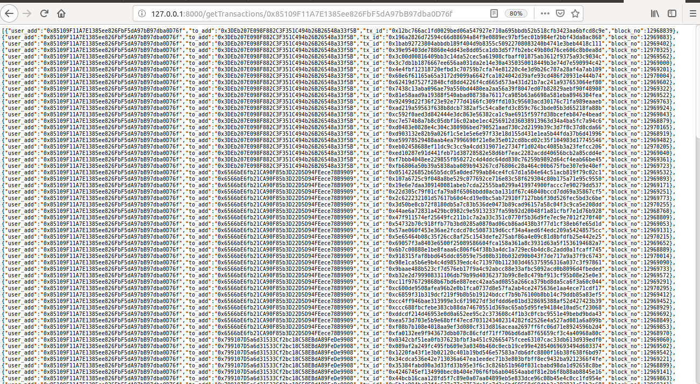

**Project Title : Design an api to fetch user transactions from etherum node hosted on infura's Kovan testnet.**

Step1: Configure following variables in utis.go 

Ethclient = [kovan testnet api end point]

Cassandrahost = [cassandra host ip address]

Keyspace = [keyspace name]

TotalBlocks = [no of recent blocks have to insert into the database]

Step 2: Run main.go file - go run main.io

    	start local server with 8000 port
	

Step 3: To insert user transaction details into the database(getting from kovan testnet api)

call api end point POST: http://127.0.0.1:8000/addTransactions/

Step 4: To get user transactions

call api end point GET: http://127.0.0.1:8000/getTransactions/{address}

Ex : http://127.0.0.1:8000/getTransactions/0x85109F11A7E1385ee826FbF5dA97bB97dba0D76f

Result : 

[[{"user_add":"0x85109F11A7E1385ee826FbF5dA97bB97dba0D76f","to_add":"0x3DEb207E098F882C3F351C494b26B26548a33f5B","tx_id":"0x12bc766ac1fd0029bed06a547927e710a695bbdb52b518cfb3423aa6bfcd8c9e","block_no":12968839},{"user_add":"0x85109F11A7E1385ee826FbF5dA97bB97dba0D76f","to_add":"0x3DEb207E098F882C3F351C494b26B26548a33f5B","tx_id":"0x196a2826d72594c66d88694a84f9e0889ec97bf5ec01b984ef2bbf43da8ac868","block_no":12969883}]

-----------------------------------------------------------------------------------------------------------------------------------------------

**Db Design**

CREATE KEYSPACE blockchain WITH replication = {'class': 'SimpleStrategy', 'replication_factor': '1'};

CREATE TABLE blockchain.transactions (
    user_add text,
    to_add text,
    tx_id text,
    block_diff varint,
    block_hash text,
    block_no varint,
    block_time varint,
    tx_gas varint,
    tx_gas_price varint,
    tx_val varint,
    PRIMARY KEY (user_add, to_add, tx_id)
);

--> PRIMARY KEY (user_add, to_add, tx_id): The partition key is user_add, the composite clustering key is (to_add, tx_id)

user_add --> sender address
to_add --> receiver address
tx_id --> transaction id

--> In cassandra [OR condition] is not supported
    thats reason i wrote two queries one for out_transactions another one for in_transactions 
    
--> getting out transactions using below query (used_add is Partition key)
    [select user_add,to_add,tx_id,block_no FROM %s.transactions where user_add = ?;]
	
--> getting in transactions using below query here created secondary index on to_add
    [select user_add,to_add,tx_id,block_no FROM %s.transactions where to_add = ?"]
    [create INDEX if NOT EXISTS to_add_index ON %s.transactions(to_add);]

**3rd party library**
gorilla/mux --> implements a request router and dispatcher for matching incoming requests to their respective handler.The name mux stands for "HTTP request multiplexer".

 

